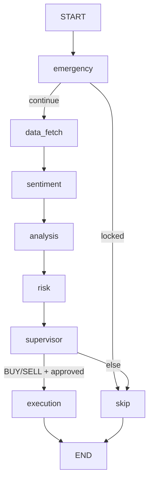

# Matrix Robot — External AI Review Brief

**Purpose of this document:** Give Windsurf (Cascade), Gemini, or any external reviewer enough context to evaluate the project architecture, agent pipeline, and tool design — **without access to secrets or the live VPS**.

**Primary IDE for implementation:** Cursor. This review is advisory only; changes are applied manually in Cursor after human approval.

**Owner context:** Iraqi trader, FundedNext Stellar 2-Step challenge. **EA/robot use is declared to the prop firm** (allowed). We explicitly **do NOT want** anti-detection, human-mimic execution, or stealth layers.

---

## 1. What Matrix Robot Is

Autonomous forex/metals/indices trading system:

- **Python Brain** (FastAPI + LangGraph) on a Windows VPS — multi-agent pipeline, LLM tool-calling
- **Node API** (Express) — proxies dashboard + Python routes
- **React Dashboard** (Vite PWA) — monitoring, mode control, scheduler UI
- **MT5 Windows Bridge** — HTTP bridge to MetaTrader 5 on same VPS
- **Market data:** Twelve Data (Grow plan, 55 req/min)
- **LLM:** OpenRouter `anthropic/claude-sonnet-4.5` (brain) + `gpt-4o-mini` (supervisor fallback)

Runs 24/7 on ForexVPS. Scheduler: auto-cycle every **60 minutes**. Weekend guard: **no LLM/analysis Sat–Sun UTC** (`tools/market_hours.py`).

---

## 2. Repository Layout (Key Paths)

```
MatrixRobot/
├── .env                          # secrets — NEVER commit or paste
├── replit.md                     # internal dev notes
├── docs/
│   └── EXTERNAL-AI-REVIEW.md     # this file
├── lib/
│   └── api-spec/openapi.yaml     # API contract (source of truth)
├── artifacts/
│   ├── python-agents/            # BRAIN — most important
│   │   ├── main.py               # FastAPI entry, scheduler restore
│   │   ├── config.py             # all pydantic settings
│   │   ├── mt5_windows_bridge.py # MT5 HTTP bridge (port 5555)
│   │   ├── agents/
│   │   │   ├── graph.py          # LangGraph state machine
│   │   │   ├── agentic_brain.py  # Claude tool-calling brain
│   │   │   ├── data_agent.py     # quotes, indicators, MTF, ICT
│   │   │   ├── sentiment_agent.py
│   │   │   ├── analysis_agent.py # rule-based ensemble fallback
│   │   │   ├── risk_agent.py     # sizing + FN guards
│   │   │   ├── supervisor_agent.py
│   │   │   └── execution_agent.py
│   │   ├── routes/
│   │   │   ├── cycle.py          # cycle run/status
│   │   │   ├── trading.py        # mode, scheduler, positions
│   │   │   └── state.py          # prop-status, analytics
│   │   └── tools/
│   │       ├── registry.py       # 17+ LangChain tools for brain
│   │       ├── prop_rules.py     # FundedNext compliance
│   │       ├── emergency_guard.py
│   │       ├── market_hours.py   # weekend pause
│   │       ├── adaptive_policy.py # APE defensive adaptations
│   │       ├── memory.py         # decisions + trade outcomes
│   │       └── twelve_data.py    # market data client
│   ├── api-server/               # Node proxy (port 8080)
│   │   └── src/routes/
│   │       ├── dashboard.ts
│   │       └── agents.ts         # proxies /api/agents/* → Python
│   └── dashboard/                # React UI (port 5173 dev)
│       └── src/pages/dashboard.tsx
```

---

## 3. LangGraph Pipeline (Every Cycle)



| Node | File | Role |
|------|------|------|
| `emergency` | `tools/emergency_guard.py` | Weekend pause, daily DD lockout, emergency liquidation **before any LLM cost** |
| `data_fetch` | `agents/data_agent.py` | Fetches all 24 symbols: quotes, H1 bars, indicators, MTF, ICT, vol regime, correlation, calendar |
| `sentiment` | `agents/sentiment_agent.py` | FinBERT or keyword news sentiment |
| `analysis` | `agents/agentic_brain.py` | **Primary:** Claude + 17 tools, up to 12 iterations. **Fallback:** `analysis_agent.py` ensemble if brain fails or returns no actionable signals |
| `risk` | `agents/risk_agent.py` | `compute_safe_sizing()`, correlation/calendar/prop veto |
| `supervisor` | `agents/supervisor_agent.py` | Final single decision (LLM or rules) |
| `execution` | `agents/execution_agent.py` | PAPER sim or MT5 live via bridge |
| `skip` | `agents/graph.py` `_node_skip` | HOLD / lockout message, no trade |

---

## 4. Agentic Brain — Tool Registry

**File:** `artifacts/python-agents/tools/registry.py`  
**Brain:** `artifacts/python-agents/agents/agentic_brain.py`  
**Model:** OpenRouter Claude Sonnet 4.5, max 12 tool-call iterations, then forced JSON output.

### Tools (preferred order in system prompt)

| Step | Tool | Purpose |
|------|------|---------|
| 0 | `get_adaptive_policy()` | Read APE state (risk cuts, paused symbols) |
| 1 | `universe_snapshot()` | Scan 24 symbols in one call |
| 2 | Deep dive (1–3 symbols) | `get_indicators`, `get_mtf_consensus`, `get_ict_smc`, `get_wyckoff`, `get_elliott_wave`, `get_harmonic_pattern`, `get_volume_profile`, `get_chart_pattern`, `get_volatility_regime`, `get_market_sentiment`, `get_economic_calendar`, `get_correlation_report`, `get_quote` |
| 3 | Self-check | `query_history(symbol)`, `get_prop_status()` |
| 4 | Defensive adapt | `apply_adaptive_change(...)` — REDUCE_RISK, PAUSE_SYMBOL, SKIP_SESSION, etc. |
| Power | `run_python_code(code)` | Sandboxed numpy/pandas, 5s, no I/O |

**Design rule:** Tools are read-only. Brain proposes; `risk_agent` + `execution_agent` have final veto.

### APE (Adaptive Policy Envelope)

**File:** `tools/adaptive_policy.py`

Brain may autonomously apply **defensive** changes only (max 3 per 24h). Cannot increase risk above baseline, enable live trading, or use Martingale/Grid/HFT.

---

## 5. FundedNext Compliance

**File:** `tools/prop_rules.py`, `config.py`

| Layer | Daily DD | Total DD | Notes |
|-------|----------|----------|-------|
| Internal (bot halts) | 4% | 9% | Buffer before FN hard caps |
| FN hard caps | 5% | 10% | Absolute red line |

Other enforced rules:

- `require_stop_loss=True` — every order has SL
- `min_position_hold_seconds=60` — **internal anti-HFT safety rule** (FN forbids HFT; 60s is conservative internal guard unless FN confirms otherwise in writing)
- `max_trades_per_day=20` — **internal safety cap only** (FN Stellar 2-Step: min 5 trading days + min 5 trades; **no official max trade count**)
- `max_concurrent_positions=5`
- `min_conviction_threshold=0.60`
- `max_risk_per_trade_pct=0.8`
- Economic calendar blackout ±10 min around HIGH events
- Margin cap 70% (internal target 50%)
- XAUUSD leverage 1:10 (Jan 2026 FN rule)

**Account profile:** `FN_CHALLENGE` (default). User will declare EA use to FundedNext.

---

## 6. Intentionally REMOVED vs. APE (Do Not Confuse)

**REMOVED** (do not suggest re-adding):
- `tools/execution_variance.py` — lot jitter, entry delay, schedule jitter, skip-signal %, fake lunch/sleep windows (human mimic / randomization)
- `tools/anti_detection.py` — human-mimic behavior
- All `EXEC_VARIANCE_*` settings in `config.py`

**ALLOWED — APE is NOT execution variance:**
- `tools/adaptive_policy.py` — defensive only: REDUCE_RISK, PAUSE_SYMBOL, TIGHTEN_CONVICTION, SKIP_SESSION
- Review focus: **APE reset** conditions (RESET_RISK, RESUME_SYMBOL, RESET_CONVICTION) — can LLM lift restrictions too fast?

**Leftover mentions only in:** `.env.example` comments, STACK/tools page descriptions — cosmetic only.

---

## 7. Deployment State (as of June 2026)

| Service | Port | Status |
|---------|------|--------|
| MT5 Bridge | 5555 | Running on VPS |
| Python Brain | 8000 | Running, OpenRouter, ACTIVE mode |
| Node API | 8080 | Running |
| Dashboard | 5173 | Dev mode on VPS (localhost) |
| MT5 terminal | — | MetaQuotes-Demo, same account on phone |

Scheduler: **60 min**, running. Weekend cycles complete in **0ms** with empty `symbols_analyzed` — market guard works.

**Not yet done:** Cloudflare Tunnel for phone dashboard, Windows auto-start (NSSM), PostgreSQL, full backtest validation.

---

## 8. Known Design Tensions (Review These)

1. **`data_agent` fetches all 24 symbols every cycle** even though brain only deep-dives 1–3 — Twelve Data API cost/limit pressure.
2. **Brain fallback:** If brain returns all HOLD or fails, pipeline falls back to deterministic `analysis_agent` ensemble — may contradict brain's conservative intent.
3. **Dual LLM:** Brain = Claude Sonnet 4.5; Supervisor = GPT-4o-mini — possible disagreement.
4. **Threshold mismatch:** Brain prompt mentions strength < 0.55 → HOLD; config `min_conviction_threshold=0.60`.
5. **Dashboard scheduler toggle** returns 401 without `VITE_ADMIN_SECRET` — scheduler started via API/PowerShell instead.
6. **No push notifications** in dashboard — user relies on MT5 mobile app for trade alerts.

---

## 9. Symbols Monitored (24)

Forex (19): EURUSD, GBPUSD, USDJPY, USDCHF, AUDUSD, NZDUSD, USDCAD, EURGBP, EURJPY, GBPJPY, EURAUD, EURCHF, AUDJPY, CHFJPY, CADJPY, NZDJPY, GBPCHF, AUDCAD, AUDNZD

Metals: XAUUSD, XAGUSD  
Indices: US30, US500, USTEC

---

## 10. Questions for Reviewers

Please answer structured feedback on:

### Architecture
1. Is the LangGraph node order optimal? Should anything move before/after `analysis`?
2. Is the emergency → skip path sufficient for weekend/market-closed guard?

### Agentic Brain
3. Is the 17-tool registry well-organized or overloaded? Suggested merges or removals?
4. Is 12 max iterations appropriate for cost vs. quality?
5. Should the ensemble fallback be removed or gated (e.g. only on LLM error, not on intentional HOLD)?

### Risk & Execution
6. Is `compute_safe_sizing()` conservative enough for FN Stellar 2-Step Phase 1?
7. Any gaps in `prop_rules.py` vs. real FundedNext 2026 rules?

### Efficiency
8. How would you reduce Twelve Data calls without hurting signal quality?
9. Would you prefetch only top-N symbols from `universe_snapshot` logic in code (not LLM)?

### Security
10. Review `run_python_code` / `sandbox.py`: disable in ACTIVE mode? Is sandbox sufficient? File read, dangerous imports, CPU abuse?

### APE
11. Review APE reset logic (RESET_RISK, RESUME_SYMBOL, RESET_CONVICTION): are recovery conditions strict enough?

### Operations
12. Priority order for: Cloudflare Tunnel, auto-start, backtest validation, removing ensemble fallback?

**Constraints for all suggestions:**
- No anti-detection / human mimic / execution variance (jitter, delay, randomization)
- APE defensive adaptations are allowed — do not remove
- User declares EA to prop firm — optimize for compliance and consistency, not stealth
- Minimize breaking changes to working VPS deployment
- Prefer small, reviewable diffs over large rewrites

---

## 11. Suggested Files to Read First (in order)

1. `artifacts/python-agents/agents/graph.py`
2. `artifacts/python-agents/agents/agentic_brain.py`
3. `artifacts/python-agents/tools/registry.py`
4. `artifacts/python-agents/agents/risk_agent.py`
5. `artifacts/python-agents/tools/prop_rules.py`
6. `artifacts/python-agents/agents/execution_agent.py`
7. `artifacts/python-agents/tools/emergency_guard.py`
8. `artifacts/python-agents/tools/market_hours.py`
9. `artifacts/python-agents/config.py`
10. `artifacts/python-agents/tools/sandbox.py`
11. `artifacts/python-agents/tools/adaptive_policy.py`

---

## 12. Copy-Paste Prompt for Windsurf / Gemini

```
You are reviewing Matrix Robot — an autonomous LangGraph trading system for FundedNext (EA declared, no stealth).

Read docs/EXTERNAL-AI-REVIEW.md first, then the files listed in section 11.

Deliver:
1. Executive summary (5 bullets)
2. Strengths (what to keep)
3. Risks / bugs / design flaws (severity: high/medium/low)
4. Top 5 actionable improvements (small diffs preferred)
5. Answers to all 12 questions in section 10

Do NOT suggest: anti-detection, execution variance (jitter/delay/randomization), human-mimic delays, hiding EA use.
APE defensive policy is ALLOWED — do not confuse with removed execution_variance.
Also review: run_python_code sandbox security + APE reset strictness.
Do NOT ask for .env or API keys.
Respond in English; owner reads Arabic summaries separately.
```

---

*Generated for external advisory review. Update this file when major architecture changes land.*
